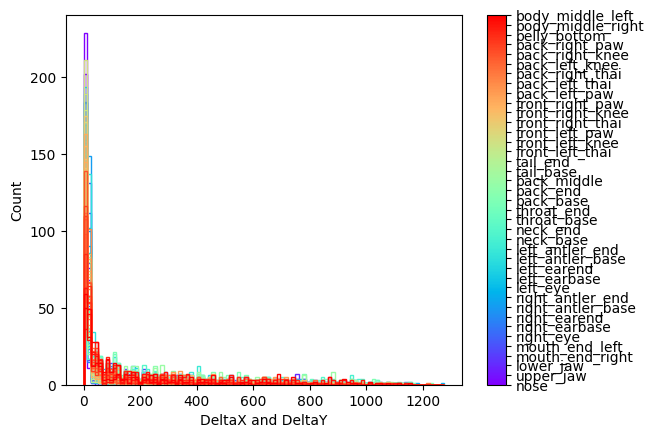
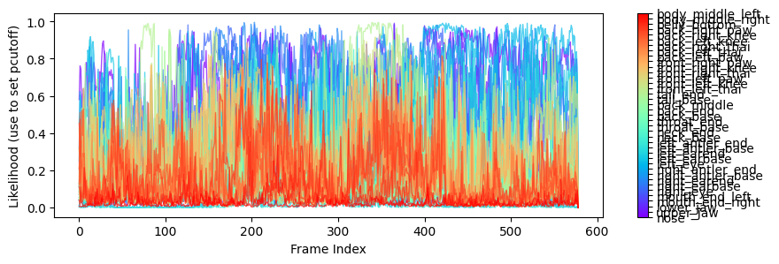
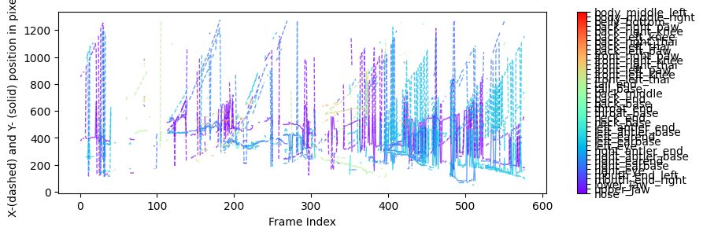
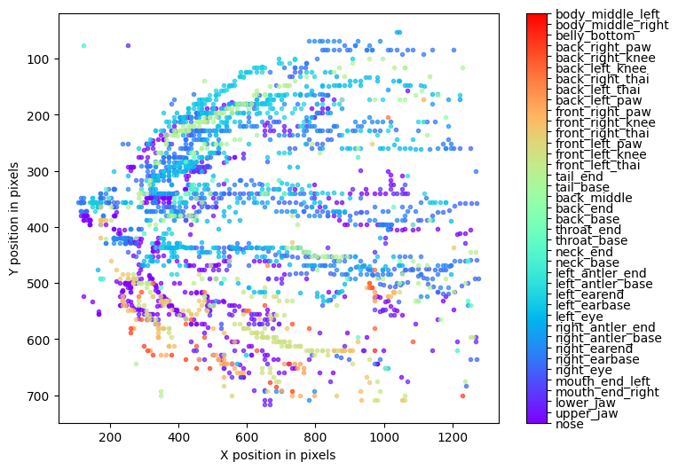

# README - Análise de Processamento de Imagens de Bovinos com MediaPipe e DeepLabCut

## 1. Análise Exploratória

A análise exploratória teve como foco a avaliação do conjunto de dados contendo imagens de bovinos, processadas por dois modelos distintos: MediaPipe e DeepLabCut. Foram gerados gráficos para ilustrar o comportamento dos modelos na detecção de landmarks (pontos-chave) nos esqueletos dos animais.

### Gráficos e Descrições:

1. **Histograma de DeltaX e DeltaY (hist.png):** 
   - Este gráfico mostra a distribuição das variações dos landmarks entre os frames, representadas pelos deslocamentos em X e Y (DeltaX e DeltaY).
   - A maior parte dos deslocamentos está concentrada entre 0 e 200 pixels, sugerindo que os pontos detectados têm um deslocamento limitado, condizente com a natureza de vídeos com movimentos suaves.
   - Deslocamentos maiores, superiores a 400 pixels, são menos frequentes e podem representar outliers ou erros de detecção, geralmente associados a momentos de maior movimento do animal ou imprecisões do modelo.
  
  

2. **Gráfico de Verossimilhança por Frame (plot-likelihood.png):**
   - O gráfico de verossimilhança reflete a confiança do modelo DeepLabCut ao longo dos frames, variando de 0 a 1, onde 1 indica alta confiança na detecção.
   - Observa-se que há uma variação significativa na confiança dos landmarks entre os frames. Em muitos casos, a verossimilhança é inferior a 0.5, indicando que o modelo pode ter dificuldades em certos momentos, devido a fatores como oclusão, qualidade de imagem ou complexidade do movimento do boi.

3. **Posição X e Y ao Longo dos Frames (plot.png):**
   - Este gráfico exibe as coordenadas X e Y dos landmarks detectados ao longo dos frames do vídeo. As linhas tracejadas representam o movimento em X e as sólidas mostram o movimento em Y.
   - A variação observada nas coordenadas sugere uma movimentação considerável em momentos específicos, possivelmente decorrente de mudanças na postura do boi ou movimentos mais bruscos.

4. **Trajetória dos Landmarks (trajectory.png):**
   - Neste gráfico, é possível visualizar as trajetórias dos landmarks detectados no plano bidimensional (X vs. Y). As diferentes cores representam os diferentes landmarks.
   - Os agrupamentos de pontos em certas áreas sugerem que algumas partes do corpo do boi permaneceram mais estáticas, enquanto áreas mais dispersas indicam partes do corpo em movimento. Este gráfico é útil para identificar padrões de movimentação de diferentes partes do corpo do animal ao longo do vídeo.

## 2. Processamento de Imagem

O processamento de imagens seguiu um fluxo bem definido e foi descrito por meio de uma figura ilustrativa e explicações detalhadas de cada etapa.

### Etapas:

1. **Processo MediaPipe:**
   - Upload de duas imagens de bois.
   - Chamada do modelo para gerar landmarks (pontos-chave do esqueleto).
   - Desenho dos landmarks do esqueleto usando a função `draw pose landmarks`.
   - Geração de uma visualização 3D dos landmarks do esqueleto.
   - Uso do parâmetro `enable_segmentation=True` para realizar a segmentação da pose do boi.
   - Impressão de todos os landmarks com o respectivo grau de visibilidade.

2. **Processo DeepLabCut:**
   - Criação de um novo projeto no DeepLabCut, configurado especificamente para detecção de animais.
   - Análise de um vídeo contendo imagens de bovinos, com o modelo detectando os pontos-chave do esqueleto dos animais.
   - Geração de um vídeo sobreposto com o esqueleto dos bovinos.
   - Análise dos gráficos gerados, com destaque para a confiabilidade dos landmarks detectados e seus deslocamentos.

## 3. Resultados Obtidos

Os resultados deste experimento evidenciaram as diferenças significativas entre os modelos MediaPipe e DeepLabCut no que diz respeito à detecção de landmarks em bovinos. 

### Descrição Detalhada dos Resultados:

- **MediaPipe:**
   - O MediaPipe é amplamente utilizado para detectar landmarks em seres humanos. Contudo, ao ser aplicado a bovinos, o desempenho foi limitado.
   - Isso se deve ao fato de que o modelo MediaPipe não foi treinado para detectar landmarks em animais quadrúpedes. Como resultado, o esqueleto gerado não conseguiu capturar adequadamente os principais pontos das articulações dos bovinos, o que demonstra uma clara limitação do modelo quando usado fora de seu contexto original.
   - A detecção de landmarks foi imprecisa, com o modelo apresentando dificuldades em adaptar-se às características anatômicas dos animais. A falta de treinamento com imagens de animais quadrúpedes torna o MediaPipe inadequado para essa tarefa.

- **DeepLabCut:**
   - Diferentemente do MediaPipe, o DeepLabCut foi projetado e ajustado especificamente para a detecção de landmarks em animais, especialmente quadrúpedes.
   - O modelo DeepLabCut demonstrou ser muito mais eficaz na identificação dos landmarks significativos dos bovinos, com alta precisão em muitos casos. Ainda assim, em momentos de maior complexidade ou baixa qualidade de imagem, a confiança do modelo caiu.
   - Trabalhar com o DeepLabCut revelou-se desafiador devido à documentação limitada, mas ele é o modelo mais indicado para tarefas envolvendo animais, uma vez que foi treinado com conjuntos de dados apropriados para essa finalidade.
   - Embora tenha havido dificuldades na geração da imagem com o esqueleto desenhado, os pontos detectados foram, na maioria, precisos. Ao aplicar um nível de confiança de 80% ou mais, o modelo ainda foi capaz de detectar os principais pontos do esqueleto bovino, sugerindo que uma aplicação prática seria viável com ajustes finos.

## 4. Conclusões Pessoais

### Principais Aprendizados:

- **Aplicabilidade de Modelos Genéricos e Específicos:**
   - O principal aprendizado deste trabalho foi entender a diferença entre modelos genéricos, como o MediaPipe, e modelos especializados, como o DeepLabCut. Enquanto o MediaPipe é altamente eficiente para detectar landmarks em seres humanos, sua aplicabilidade é limitada quando usado fora desse escopo, especialmente em animais quadrúpedes. Isso reforça a importância de escolher o modelo adequado ao contexto e à especificidade da tarefa.
   - Já o DeepLabCut, sendo um modelo treinado exclusivamente para detecção de animais, mostrou-se uma ferramenta muito mais precisa e confiável para este tipo de tarefa. A sua versatilidade ao trabalhar com diferentes tipos de animais, incluindo bovinos, destaca a necessidade de usar modelos ajustados para casos de uso específicos.

- **Desafios Técnicos e Documentação:**
   - Outro aprendizado importante foi o desafio técnico de implementar o DeepLabCut, especialmente devido à documentação. No entanto, após superar as dificuldades iniciais, ficou claro que este modelo oferece resultados superiores quando comparado a soluções genéricas.

### Limitações do Trabalho:

- **MediaPipe:** A principal limitação foi o uso do MediaPipe para detecção em bovinos, pois o modelo não foi treinado para detectar landmarks em animais quadrúpedes.
- **DeepLabCut:** O DeepLabCut apresentou limitações na documentação e na geração de visualizações do esqueleto, o que dificultou a análise de alguns resultados.

### Sugestões para Trabalhos Futuros:

- **Transfer Learning:** Implementar técnicas de transfer learning utilizando conjuntos de dados de bovinos para refinar ainda mais o desempenho do DeepLabCut.
- **Filtros para Outliers:** Aplicar filtros de suavização e técnicas de filtragem de outliers para melhorar a precisão do rastreamento de landmarks.
- **Ajuste de Parâmetros:** Refinar os parâmetros de cutoff e confiança para aumentar a consistência e precisão do DeepLabCut em imagens com grande variação de qualidade.

## Vídeo da Pose Estimation:
[Vídeo com o Pose Estimation](https://drive.google.com/file/d/18akmHNNVCw3YGGn4Lfdr9mfLECtzi6lb/view?usp=sharing)
# pose_estimation
